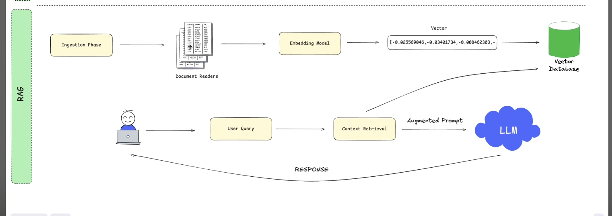

#  RAG-AI PDF Chatbot
Spring Boot + Spring AI + VectorStore + PDF Ingestion
---
curl -G --data-urlencode "q=Bu belgenin ana konusu nedir?" http://localhost:8080/chat

## RAG Overview  

## 📖 What is RAG (Retrieval-Augmented Generation)?

**Retrieval-Augmented Generation (RAG)** is a technique designed to overcome the limitations of Large Language Models (LLMs).  
Normally, LLMs only have knowledge up to the **date they were trained** and are **not trained on your private data**.  
This leads to several issues:
- Outdated information
- Inability to access enterprise-specific data
- Hallucinations (confident but incorrect answers)

**The RAG solution in this project:**
- Documents (in our case **PDF files**) are automatically **ingested and converted into embeddings** using **OpenAI’s `text-embedding-3-small` model**.
- These embeddings are stored in a **PostgreSQL database** using the **pgvector extension**.
- When a user asks a question via the `/chat` endpoint, the system first performs a **semantic search** over the vector database to retrieve the most relevant chunks of text.
- The retrieved context is then appended to the user query and sent to the LLM through **Spring AI**.
- The LLM combines its own knowledge with the retrieved enterprise data to generate **accurate, up-to-date, and domain-specific answers**.

---

## 🚀 Where is RAG Used?

RAG plays a critical role in **enterprise AI solutions**, especially when combined with scalable backend frameworks like **Spring Boot**:

- 📚 **Document Search & Q&A** → Search across large collections of PDFs and generate contextual summaries.
- 🏦 **Banking & Finance** → Query compliance reports, regulations, or customer contracts reliably.
- ⚖️ **Legal** → Retrieve the most relevant case law or legal precedent from thousands of documents.
- 🏥 **Healthcare** → Support clinical decisions by retrieving information from patient reports and medical research.
- 👩‍💼 **Enterprise Knowledge Base** → Allow employees to query internal documents in natural language.

---

## 🎯 Why RAG Matters in This Project?

- ✅ LLMs are **no longer limited** to their training cut-off date.
- ✅ With **Spring Boot**, we integrate RAG into a **production-ready backend system**.
- ✅ With **Spring AI**, the model orchestration and API communication are streamlined.
- ✅ With **pgvector**, embeddings are efficiently stored and queried inside PostgreSQL.
- ✅ With **PDF ingestion**, enterprise knowledge becomes instantly searchable and accessible.
- ✅ This architecture significantly reduces hallucinations and enables **trustworthy, domain-specific AI responses**.

---

## ⚙️ Project Architecture

The project integrates the following technologies:

- **Spring Boot** → RESTful API layer (`/chat` endpoint)
- **Spring AI** → OpenAI integration for embeddings & LLM responses
- **pgvector (PostgreSQL extension)** → Vector database for semantic search
- **PDF ingestion pipeline** → Automatic document chunking & embedding
- **cURL API calls** → Example queries like:

```bash
curl -G --data-urlencode "q=What is the main topic of this document?" http://localhost:8080/chat
curl -G --data-urlencode "q=Bu belgenin ana konusu nedir?" http://localhost:8080/chat
---

 

---

## 🛠️ Technologies Used

This project is built with a modern and production-grade tech stack:  

- **Java 17** → Core programming language (LTS version, ensures stability and performance)  
- **Spring Boot 3.x** → Backend framework providing REST APIs and configuration management  
- **Spring AI** → Seamless integration with OpenAI models (embeddings + LLM orchestration)  
- **PostgreSQL 15** → Relational database system for persistent storage  
- **pgvector extension** → PostgreSQL vector database extension for semantic search and embeddings storage  
- **Docker & Docker Compose** → Containerization of the application and database for easy deployment  
- **cURL** → Lightweight command-line tool for testing the `/chat` REST API endpoints  

---

## 📦 Project Dependencies

The project integrates the following major dependencies (defined in `pom.xml`):  

- **spring-boot-starter-web** → Build RESTful APIs  
- **spring-boot-starter-data-jpa** → ORM support with Hibernate  
- **spring-ai-openai** → OpenAI client integration for embeddings and LLM  
- **spring-ai-pgvector** → Spring AI + pgvector integration  
- **postgresql** → JDBC driver for PostgreSQL  
- **lombok** → Reduce boilerplate code (getters, setters, builders)  
- **hibernate** → ORM implementation for JPA  

---

## 📊 High-Level Architecture

1. **PDF Ingestion**  
   - PDFs placed under `/docs/` are automatically split into chunks.  
   - Each chunk is embedded using OpenAI’s `text-embedding-3-small`.  

2. **Vector Storage (pgvector + PostgreSQL)**  
   - Embeddings are stored in a vector database table (`vector_store`).  
   - Semantic similarity search retrieves the most relevant chunks.  

3. **Spring Boot API**  
   - REST endpoints (e.g., `/chat`) allow external clients to query the system.  
   - User queries are enriched with retrieved context.  

4. **Spring AI + LLM**  
   - Augmented prompt (query + retrieved context) is sent to the LLM.  
   - The response combines **general knowledge + enterprise data**.  

5. **Dockerized Deployment**  
   - PostgreSQL + pgvector run inside containers.  
   - Spring Boot service can also be dockerized for production.  

---
